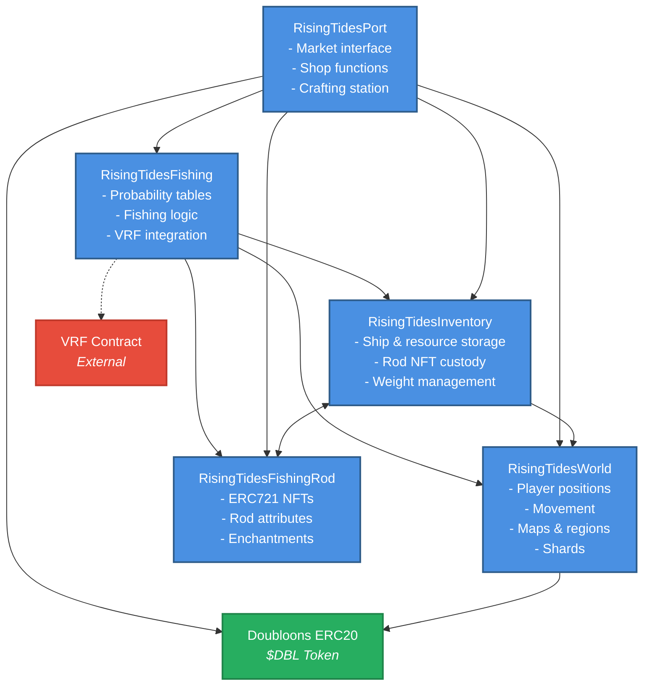

# Rising Tides Smart Contract Dependency Graph

## Visual Representation

## Dependency Details

### RisingTidesWorld

**Dependencies:**

- `Doubloons (DBL)` - For map travel fees

**Used by:**

- `RisingTidesFishing` - Validates player position for fishing
- `RisingTidesInventory` - Validates player exists and location
- `RisingTidesPort` - Checks if player is at port for trading

### RisingTidesFishing

**Dependencies:**

- `RisingTidesWorld` - Get player position and region type
- `RisingTidesInventory` - Check/consume bait, add caught fish
- `RisingTidesFishingRod` - Get rod attributes for fishing calculations
- `VRF Contract` - External randomness for fair fish generation

**Used by:**

- `RisingTidesPort` - May need fishing data for market analytics

### RisingTidesInventory

**Dependencies:**

- `RisingTidesWorld` - Validate player registration
- `RisingTidesFishingRod` - Custody of equipped rod NFTs (bidirectional)
- `IERC721` - Interface for rod NFT transfers

**Used by:**

- `RisingTidesFishing` - Consume bait, add caught fish
- `RisingTidesPort` - All inventory modifications
- `RisingTidesWorld` - Check fuel and ship stats for movement

### RisingTidesPort

**Dependencies:**

- `RisingTidesInventory` - Modify player inventories
- `RisingTidesWorld` - Verify player at port
- `RisingTidesFishingRod` - Create/repair rods
- `RisingTidesFishing` - Access fish probability data
- `Doubloons (DBL)` - Handle all currency transactions

**Used by:**

- None (top-level user interface contract)

### RisingTidesFishingRod

**Dependencies:**

- None (standalone ERC721)

**Used by:**

- `RisingTidesFishing` - Read rod attributes
- `RisingTidesInventory` - Track equipped rods
- `RisingTidesPort` - Mint/repair rods

## Key Observations

1. **RisingTidesPort** is the main entry point for most player actions
2. **RisingTidesWorld** is the foundational contract that others depend on
3. **RisingTidesFishingRod** is the most independent (pure ERC721)
4. **RisingTidesFishing** bridges gameplay mechanics with inventory
5. The system has clear separation of concerns with minimal circular dependencies

## Deployment Order

Based on dependencies, the recommended deployment order is:

1. `Doubloons (DBL)` - Token contract
2. `RisingTidesFishingRod` - No dependencies
3. `RisingTidesWorld` - Only depends on DBL
4. `RisingTidesInventory` - Depends on World and Rod
5. `RisingTidesFishing` - Depends on World, Inventory, and Rod
6. `RisingTidesPort` - Depends on all others
